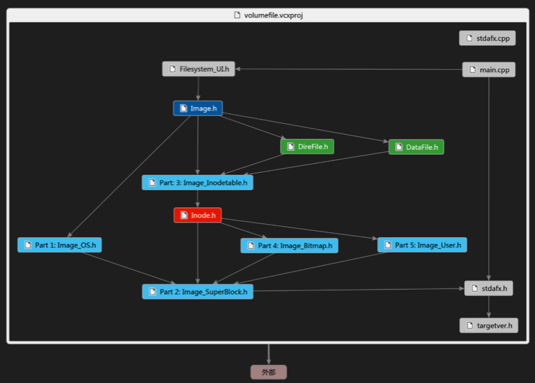

# 模拟 Unix 文件系统

### 1. 题目

构造模拟二级文件系统。

### 2. 软件的功能

模拟 Unix V6++ 的文件系统结构

- 实现部分文件管理的 Unix Shell 命令
- 实现下列功能
  - 当前目录的切换与显示
  - 新建文件
  - 删除文件
  - 打开数据文件并进行查看和编辑
  - 创建目录和删除空目录
  - 自动写回功能（能够最大程度地避免数据丢失，详见 4.1）

### 3. 软件的结构

#### 3.1. “磁盘”结构

*（在本模拟二级文件系统中，“ ‘磁盘’ ”指 Windows 操作系统中实际存在的 1 GiB 文件，下同 ）*

盘块与“磁盘”

- 盘块：大小固定，为 512 Bit。
- “磁盘”：0# ~ 2097151#，共有 2097152 个盘块，大小 1 GiB。

BIOS与操作系统

- 0# ~ 199#，共有 200 个盘块，大小 100 KiB。
- 在本模拟二级文件系统中，这一区域全部以`\x11`填充，不使用。

文件系统超级块

- 200#，共 1 个盘块，大小 0.5 KiB。
- 其中，前 24 个字节存放内存中的 6 个内存地址，它们对“磁盘”而言是无意义的数据。其他字节全部以 `\x22`填充，不使用。

Inode节点表

- 201# ~ 1535#，共 1335 个盘块，大小 667.5 KiB。
- 每个 Inode 节点的大小固定为 64 Bit，所以这张 Inode 节点表最多可放有 10680 节点。也就是说，本模拟二级文件系统中的文件/目录总数最多为 10680。

盘块位示图

- 1536# ~ 2047#，共 512 个盘块，大小 256 KiB。
- 盘块位视图的每一位表示一个盘块的当前状态，`0`表示空闲，`1`表示占用。计算可知大小为 256 KiB 的盘块位示图恰好可以表示整个 1 GiB 空间的使用情况。
- 盘块位视图中的前 256 个字节均为`\xFF`，表示系统盘块不参与实际分配。

用户数据

- 2048# ~ 2097151#，共 2095104 个盘块，大小2047 MiB。
- 存放文件数据、目录数据（包括根目录在内）和文件索引盘块（在`Class Inode`中会有定义）。

#### 3.2. 内存结构

##### 3.2.1. 数据结构概览

**本模拟二级文件系统的特色是——整体 IO：在系统初起后，把“磁盘”整体读入内存，建立“磁盘”内存映像。在系统关闭前，把“磁盘”内存映像整体写入“磁盘”中。**

这样做的优点是可以从总体上节约 IO 操作的时间，因为对于磁盘这种块设备，在读写相同的数据量的前提下，整体读写远比少量多次读写节约时间。所付出的代价是，需要足够大的内存来存放整个磁盘的映像。

这是个典型的“以空间换时间”的解决方案，灵感来源与现在逐渐流行的 RAMOS（通俗地说，就是“用内存做磁盘”）。笔者希望在本模拟二级文件系统上，尝试这一技术。

**由于采用了这一设计思想，对于本模拟二级文件系统，目录/文件没有“打开”的概念。或者说，所有文件/目录都已经处于“打开”状态。**

系统初起时，会在内存中建立一个`ui`对象（`Class FileSystem_UI`），这一步体现在`main`函数中。`ui`对象含有指针`image`（指向`Class Image`的对象），`image`指向的对象中含有下列对象：

| 对象               | 类型                     |
| ------------------ | ------------------------ |
| `operating_system` | `Class Image_OS`         |
| `super_block`      | `Class Image_SuperBlock` |
| `inode_table`      | `Class Image_InodeTable` |
| `bit_map`          | `Class Image_BitMap`     |
| `user_dala`        | `Class Image_UserData`   |

在这些对象中：

| 对象                       | 类型                     | 对应关系 | 内存映像       |
| -------------------------- | ------------------------ | -------- | -------------- |
| `operating_system.content` | `char *`                 | 指向     | BIOS与操作系统 |
| `super_block`              | `Class Image_SuperBlock` | 为       | 文件系统超级块 |
| `inode_table.content`      | `Inode *`                | 指向     | Inode节点表    |
| `bit_map.content`          | `char *`                 | 指向     | 盘块位示图     |
| `user_dala.content`        | `char *`                 | 指向     | 用户数据       |

本模拟二级文件系统的具体实现，源代码中有很详细的注释，请移步至`VolumeFile\`下的各个`.h`头文件中查看。

##### 3.2.2. 头文件概览

整个 VolumeFile 项目中含有12个`.h`文件和2个`.cpp`源文件。

| 文件                 | 内容                                                  |
| -------------------- | ----------------------------------------------------- |
| `main.cpp`           | 含有`main`函数                                        |
| `stdafx.cpp`         | VS自动生成                                            |
| `DireFile.h`         | 定义了`Class DireEntry`和`Class DireFile`             |
| `DataFile.h`         | 定义了`Class DataFile`                                |
| `FileSystem_UI.h`    | 定义了`Class DecomPathItem`和`Class FileSystem_UI`    |
| `Image.h`            | 定义了`Class Image`                                   |
| `Image_OS.h`         | 定义了`Class Image_OS`                                |
| `Image_SuperBlock.h` | 定义了`Class Image_SuperBlock`                        |
| `Image_InodeTable.h` | 定义了`Class Image_InodeTable`                        |
| `Image_BitMap.h`     | 定义了`Class Image_BitMap`                            |
| `Image_User.h`       | 定义了`Class Image_User`                              |
| `Inode.h`            | 定义了`Class Inode`                                   |
| `stdafx.h`           | 所有的包含编译器头文件的指令，如`#include <iostream>` |
| `targetver.h`        | VS自动生成                                            |

##### 3.2.3. 头文件的包含关系图



其中：

- 以**深蓝色**标识的头文件定义了读入“磁盘”、写出“磁盘”和格式化“磁盘”等操作；
- 以**浅蓝色**标识的头文件用于构建“磁盘”的内存映像；
- 以**绿色**标识的头文件用于定义在本模拟二级文件系统中对目录/文件的操作；
- 以**红色**标识的头文件是本模拟二级文件系统的核心。

### 4. 软件的操作说明

#### 4.1. 概述

##### 4.1.1. 本模拟二级文件系统的特性

- 最大可用空间：1023 MiB
- 最大单文件大小：16.12 MiB
- 目录最大容纳子文件/子目录的数量：96

##### 4.1.2. 运行程序

打开`VolumeFile.exe`之后，程序会检测是否有已经存在的“磁盘”。

如果没有，程序会自动创建一个。此时，程序将在桌面上新建文件夹`VolumeFile`，随后文件夹`VolumeFile`下建立文件`disk.dat`。文件`disk.dat`有 1 GiB 大小，这就是本模拟二级文件系统的“磁盘”。然后，程序进行格式化“磁盘”操作。

如果有，即文件`桌面\VolumeFile\data.dat`已经存在，那么程序会检查“磁盘”的格式。如果格式正确，那么进行读入“磁盘”操作，否则，进行格式化“磁盘”操作。

上述操作完成后，程序就可以接受用户的操作指令（详见 6.2），然后在“磁盘”上进行相应操作了。

**请务必保证C盘有足够的空间，否则程序将不能正常运行！**

（上述操作的源代码详见`VolumeFile\Image.h`中`Class Image`里面的函数`Image`）

每次用户操作之后，系统会输出当前目录下的文件，相当于在Unix中执行`cd -ls`命令。输出内容也与之相仿，但是有两个不同的地方：第一，没有“硬链接数量”；第二，含有两个纯数字，前一个是文件的实际大小，后一个是文件占用的空间（这个值一定是 512 的倍数），单位是字节。

特别提醒：如果程序异常结束或者被外界终止，将使得内存映像未能写出到“磁盘”，最终导致数据丢失。所以，**不要点击右上角的“X”来退出程序！退出程序的正确方法是：输入`exit`或`shutdown`。**

当然，为了尽量避免这种情况的发生，程序具有自动写回的功能。

当自动写回开启时，每当程序执行完用户输入的指令，就会自动计算当前时刻与上一次写出“磁盘”时刻之间的时间间隔。如果时间间隔超过临界值，那么系统会执行一次写出“磁盘”操作。

自动写回功能默认是开启的，临界值是60秒。用户输入`sync`命令后，可以进行设置。

（上述操作的源代码详见`VolumeFile\FileSystem_UI.h`中`Class FileSystem_UI`里面的函数`Run`和函数`AutoSyncOutSetting`）

#### 4.2. 操作指令

##### 4.2.1. 命令 + 空格 + 路径

**命令**

``` bash
# 转到目录
cd

# 创建文件或者目录
create

# 删除文件或者空目录（仅含有目录项“.”和“..”的目录）
remove

# 打开文件
open
```

**路径**

输入Unix Shell的标准路径即可，但是有几个需要注意的地方：

- 文件和目录的区分：以`/`结尾的是目录，否则是文件
- 路径的层数限制：路径不能超过 16 层
- 文件/目录名称长度限制：任何一个文件/目录名称不超过 27 字节

**补充说明**

- `cd`只能用于目录的路径前，`open`只能用在文件的路径前。
- `open`操作将调用 Windows 的 notepad（记事本）来查看和编辑文件。执行`open`命令时，程序将暂停运行，直到 notepad 窗口被关闭。

##### 4.2.2. 命令

``` bash
# 关闭程序
shutdown

# 关闭程序
exit

# 自动写回设置
sync
```

### 5. 软件的开发平台

- 使用 Microsoft Visual Studio 2013 Ultimate 开发（从[这里](https://msdn.itellyou.cn/)下载）。
- 使用 C++ 语言开发

### 6. 软件的运行要求

- CPU
  - x86 架构
- 操作系统
  - Windows 7
  - Windows 8
  - Windows 8.1

### 7. 其他

- 所有".md"文件是用 [Typora](http://typora.io) 编写的。
- 所有".md"文件的风格是 [Github Flavored Markdown](https://guides.github.com/features/mastering-markdown/#GitHub-flavored-markdown)。
- 各行以CRLF（Windows）结尾。
